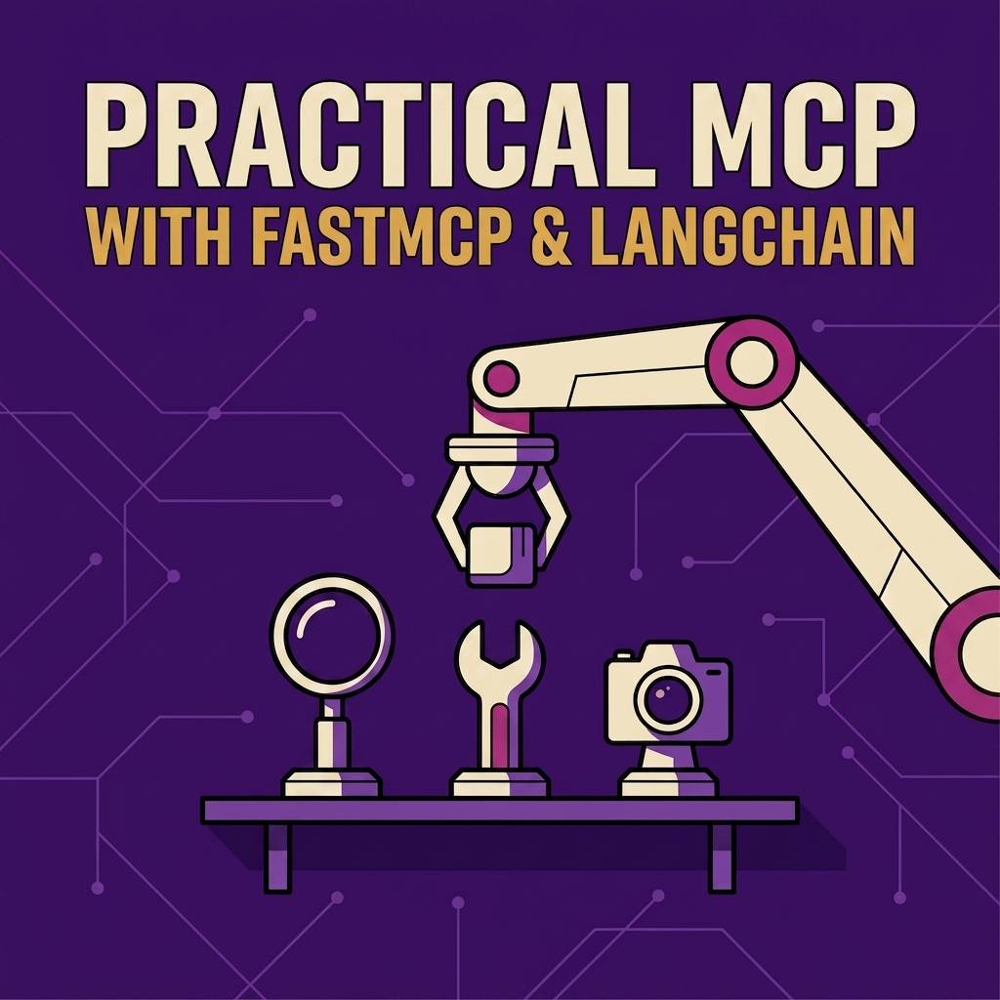

# Awesome MCP

## Sponsored by FAUN.dev()

**Practical MCP with FastMCP & LangChain: Engineering the Agentic Experience**

Stop building chatbots. Start building AI systems that actually do things -> Get your copy of my course [Practical MCP with FastMCP & LangChain](https://faun.dev/sensei/academy/practical-mcp-with-fastmcp-langchain-2ce0af-02ad51/).

---

This is a curated map of the MCP ecosystem: the projects, tools, and resources worth knowing after you have built and shipped your first servers.

**Note**: **This is not a list of MCP servers**. It's a list of tools and resources for developers and engineers building MCP applications.

- [Awesome MCP](#awesome-mcp)
  - [Sponsored by FAUN.dev()](#sponsored-by-faundev)
  - [Specification and Official Resources](#specification-and-official-resources)
  - [Learning Resources](#learning-resources)
  - [Newsletters and Communities](#newsletters-and-communities)
  - [Server Frameworks and SDKs](#server-frameworks-and-sdks)
    - [Open Source](#open-source)
  - [Gateways and Proxies](#gateways-and-proxies)
    - [Open Source](#open-source-1)
    - [Commercial](#commercial)
  - [Registries and Discovery](#registries-and-discovery)
    - [Open Source](#open-source-2)
    - [Commercial](#commercial-1)
  - [Clients and Host Applications](#clients-and-host-applications)
    - [Open Source](#open-source-3)
    - [Commercial](#commercial-2)
  - [Security and Auth](#security-and-auth)
    - [Open Source](#open-source-4)
  - [Observability and Debugging](#observability-and-debugging)
    - [Open Source](#open-source-5)
  - [Deployment and Hosting](#deployment-and-hosting)
    - [Commercial](#commercial-3)

## Specification and Official Resources

- [Model Context Protocol specification](https://modelcontextprotocol.io) - the canonical spec, concepts, and transport definitions. Read this before trusting any third-party explainer.
- [MCP GitHub organization](https://github.com/modelcontextprotocol) - SDKs, reference servers, the inspector, the registry, and the docs, all in one place.
- [MCP blog](https://blog.modelcontextprotocol.io) - protocol release candidates, registry announcements, and governance updates. The fastest way to learn what changed.
- [MCP Inspector](https://github.com/modelcontextprotocol/inspector) - the official GUI for connecting to a server and exercising its tools, resources, and prompts by hand. Your first debugging stop.

## Learning Resources

- [Official MCP documentation](https://modelcontextprotocol.io) - tutorials, concept guides, and the client and server build walkthroughs, kept current with the spec.
- [FastMCP documentation](https://gofastmcp.com) - deep, example-driven docs for the framework used throughout this book.
- [DeepWiki](https://deepwiki.com) - AI-generated, browsable documentation for MCP repositories, handy for orienting yourself in an unfamiliar codebase fast.
- [Reference servers](https://github.com/modelcontextprotocol/servers) - the official educational implementations (filesystem, fetch, memory, and more), maintained to demonstrate SDK usage and protocol features cleanly.
- [Practical MCP with FastMCP & LangChain](https://faun.dev/sensei/academy/practical-mcp-with-fastmcp-langchain-2ce0af-02ad51/) - A hands-on course for engineers done with demos: build production-grade MCP servers, clients, and middleware with FastMCP and LangChain, from first principles through human-in-the-loop flows, progress and sampling, RAG, and stateful deployment, capped by a full PostgreSQL and Redis analytics system.

## Newsletters and Communities

- [AILinks](https://faun.dev/topics/ailinks): Generative AI is changing everything, and most of the coverage is noise. We cut through it - one weekly issue packed with the most relevant tools, research, and news in AI and machine learning, with a take you won't find anywhere else.

## Server Frameworks and SDKs

### Open Source

- [FastMCP](https://github.com/jlowin/fastmcp) - the Pythonic, high-level way to build servers and clients, and the framework this book is built around. Docs at [gofastmcp.com](https://gofastmcp.com).
- [Python SDK](https://github.com/modelcontextprotocol/python-sdk) - the official low-level Python implementation. FastMCP's foundations were upstreamed here.
- [TypeScript SDK](https://github.com/modelcontextprotocol/typescript-sdk) - official, runs on Node.js, Bun, and Deno. The reference implementation for the JavaScript world.
- [Go SDK](https://github.com/modelcontextprotocol/go-sdk) - official, maintained in collaboration with Google.
- [C# SDK](https://github.com/modelcontextprotocol/csharp-sdk) - official .NET SDK, maintained with Microsoft.
- [Java SDK](https://github.com/modelcontextprotocol/java-sdk) and [Spring AI MCP](https://docs.spring.io/spring-ai/reference/api/mcp/mcp-overview.html) - official Java support, with Spring AI providing the higher-level integration.
- [mcp-framework](https://github.com/QuantGeekDev/mcp-framework) - a TypeScript framework with automatic tool discovery and multi-transport support, aiming to fill the ergonomic gap that FastMCP fills in Python.

## Gateways and Proxies

### Open Source

- [Klavis](https://github.com/Klavis-AI/klavis) - a Y Combinator-backed platform offering 50+ hosted MCP servers with enterprise OAuth, so agents reach tools like GitHub, Slack, and Gmail reliably at scale. Apache 2.0.
- [agentgateway](https://agentgateway.dev) - a Rust data-plane gateway with native MCP and A2A support, JWT and OAuth, tool-level RBAC, and OpenTelemetry tracing. A Linux Foundation project contributed by Solo.io, with Envoy and Istio roots.
- [Unla](https://github.com/AmoyLab/Unla) - a lightweight Go gateway that turns existing REST, gRPC, or WebSocket APIs and MCP servers into MCP endpoints through configuration alone, with a management UI.
- [AIRIS MCP Gateway](https://github.com/agiletec-inc/airis-mcp-gateway) - a Docker-based multiplexer that collapses many tools behind a handful of meta-tools (find, exec, schema, route, and others), using progressive disclosure to cut context tokens, with server lifecycle states and circuit breaking.
- [Docker MCP Gateway](https://github.com/docker/mcp-gateway) - runs MCP servers as isolated containers with credential injection and restricted privileges by default. Ships with Docker Desktop's MCP Toolkit.
- [IBM ContextForge](https://github.com/IBM/mcp-context-forge) - a gateway, registry, and proxy that federates MCP, A2A, and REST or gRPC behind one endpoint, with a plugin system, virtual servers, and OpenTelemetry. Strong community traction.
- [Jetski](https://github.com/hyprmcp/jetski) - from hyprmcp, adds OAuth 2.1, dynamic client registration, real-time logging, and prompt visibility to existing MCP servers with no code changes.
- [MCPJungle](https://github.com/mcpjungle/MCPJungle) - a self-hostable gateway and registry that centralizes many servers behind one endpoint, with tool groups, access control, and audit trails. A sensible default for small to medium teams.
- [MCPO](https://github.com/open-webui/mcpo) - not a router but an MCP-to-OpenAPI proxy that exposes any MCP server as a REST endpoint, so non-MCP clients (Open WebUI and others) can use it. The most popular option for personal setups.
- [Gate22](https://github.com/aipotheosis-labs/gate22) - a gateway and control plane from Aipotheosis Labs (ACI.dev) that lets teams govern which tools agents may call, expose curated bundles through a single search-and-execute endpoint, and audit every use.
- [hyper-mcp](https://github.com/tuananh/hyper-mcp) - a fast, security-minded MCP server whose capabilities are WebAssembly plugins distributed as signed OCI images, runnable from the edge to IoT.
- [mcpproxy-go](https://github.com/smart-mcp-proxy/mcpproxy-go) - a lightweight local proxy that fronts many servers through one endpoint, adding BM25 tool search, activity logs, a quarantine security mode, and a web UI.
- [Kuadrant MCP Gateway](https://github.com/Kuadrant/mcp-gateway) - an Envoy- and Istio-based gateway that applies Kubernetes policy-attachment for authentication, authorization, and rate limiting to MCP traffic.
- [Lasso MCP Gateway](https://github.com/lasso-security/mcp-gateway) - a security-first, plugin-based gateway focused on tool authorization, network filtering, and content inspection against MCP-specific attack vectors.
- [Open Edison](https://github.com/Edison-Watch/open-edison) - a secure gateway and control panel from Edison Watch that guards against the "lethal trifecta" of agent data exfiltration with per-tool access levels and execution controls.
- [Plano](https://github.com/katanemo/plano) - an Envoy-based, AI-native proxy and data plane for agentic apps, with orchestration, guardrails, and smart LLM routing, now fronting MCP servers too. Built by core Envoy contributors.
- [Pomerium](https://github.com/pomerium/pomerium) - an established open-source access proxy that now secures MCP servers with authentication and per-tool access policies.
- [ToolSDK MCP Registry](https://github.com/toolsdk-ai/toolsdk-mcp-registry) - a self-hosted enterprise gateway with federated search, sandboxed tool execution, an OAuth 2.1 proxy, and a unified HTTP API, deployed via Docker.
- [Bifrost](https://github.com/maximhq/bifrost) - a high-performance Go AI gateway from Maxim AI that doubles as an MCP gateway, centralizing tool connections, governance, and auth. Apache 2.0.
- [DeployStack](https://github.com/deploystackio/deploystack) - a team layer over MCP with an encrypted credential vault, RBAC, and one shared endpoint for a whole team. AGPL-3.0.
- [MCP Gateway & Registry](https://github.com/agentic-community/mcp-gateway-registry) - an enterprise gateway and registry combining OAuth via Keycloak or Entra with dynamic tool discovery and unified, auditable access for agents and coding assistants.
- [MCP Mesh](https://github.com/decocms/mesh) - deco's control plane routing all MCP traffic through one governed endpoint, with OAuth 2.1 and API-key RBAC, an encrypted token vault, composable virtual MCPs, and OpenTelemetry.
- [MetaMCP](https://github.com/metatool-ai/metamcp) - an aggregator and middleware layer, itself an MCP server, that groups servers into namespaces, remixes their tools, and applies pluggable middleware behind authenticated endpoints.
- [Microsoft MCP Gateway](https://github.com/microsoft/mcp-gateway) - a reverse proxy and control plane for session-aware routing and lifecycle management of MCP servers on Kubernetes, with Entra ID auth. Enterprise-oriented.
- [Nexus](https://github.com/grafbase/nexus) - Grafbase's Rust router that unifies MCP servers and LLM providers behind one endpoint, with fuzzy tool search, rate limiting, and OAuth.
- [Obot](https://github.com/obot-platform/obot) - an MCP platform (gateway, registry, hosting, and chat client) that enforces OAuth, applies access policies, and audits every call.

### Commercial

- [Arcade](https://www.arcade.dev) - a hosted platform for securely connecting agents to MCP servers, APIs, and data, with auth and tool-calling built in.
- [Alpic](https://alpic.ai) - a managed cloud platform for shipping and running MCP servers as an AI-native layer over your product.
- [E2B](https://e2b.dev/docs/mcp) - sandboxed infrastructure exposing 200+ tools to agents over MCP.
- [Peta](https://peta.io) - a self-hosted "1Password for AI agents" pairing an MCP vault with a gateway and human-in-the-loop approvals.
- [MCP Manager](https://www.mcpmanager.ai) - a control layer for MCP at scale, with granular access control, audit trails, and security guardrails.
- [mcp-use Cloud](https://mcp-use.com) - aggregates and spins up MCP servers behind one endpoint with minimal setup.
- [mcpgate](https://mcpgate.de) - a self-hosted gateway with PII pseudonymization, layered YAML policy hooks, and first-party integrations. BSL 1.1, free for small teams.
- [Metorial](https://metorial.com) - connects agents to external tools over MCP, with enterprise observability and scaling.
- [Zuplo](https://zuplo.com/features/ai-gateway) - an AI gateway with self-serve federation, hierarchical cost controls, guardrails, and semantic caching.
- [MintMCP](https://mintmcp.com) - an enterprise gateway with one-click deploys, OAuth and SSO, monitoring, and real-time security guardrails.
- [Ventil AI](https://ventil.ai) - agent-native connectivity across a business's tools.
- [PolicyLayer](https://policylayer.com) - a hosted gateway that enforces deterministic rules on every tool call, outside the model's reasoning loop.
- [Rube](https://rube.composio.dev) - Composio's MCP server linking AI tools to 500+ apps such as Gmail, Slack, GitHub, and Notion.
- [Runlayer](https://www.runlayer.com) - a managed layer for connecting MCPs more simply and safely.
- [Scalekit](https://www.scalekit.com/agentic-actions) - a secure tool-calling layer giving agents user-consented, delegated access to apps like Gmail, Calendar, and Slack, with token vaulting.
- [MCP Boss](https://www.mcp-boss.com) - a management platform for running MCP across individuals and teams.
- [Webrix](https://webrix.ai) - enterprise AI-adoption infrastructure with a secure MCP gateway, SSO, RBAC, audit trails, and governance for connecting agents to internal tools.
- [Onbox](https://onbox.ai) - a unified context layer for AI agents.
- [ToolRouter](https://toolrouter.com) - one account and API key that gives agents on-demand access to 150+ tools across many providers.
- [TrueFoundry](https://www.truefoundry.com/mcp-gateway) - an enterprise MCP gateway for secure, unified access to MCP servers.
- [TurboMCP](https://turbomcp.ai) - a platform for connecting your apps to AI on your own terms.
- [Unified Context Layer](https://ucl.dev) - a multi-tenant MCP server connecting agents to 1,000+ SaaS tools through a single standardized endpoint.
- [Dedalus Labs](https://www.dedaluslabs.ai) - a single API to connect any LLM to any MCP server.
- [Golf](https://golf.dev) - deploys production-ready, branded MCP servers for a company's APIs.
- [Kong AI Gateway](https://konghq.com/blog/product-releases/enterprise-mcp-gateway) - MCP support layered onto Kong's API gateway via the AI MCP Proxy plugin (Gateway 3.12), translating MCP to HTTP so existing REST APIs are reachable by MCP clients, with Kong's rate limiting, auth, caching, and tracing. Enterprise-only.
- [Composio](https://composio.dev) - an agentic integration platform with an MCP gateway offering 500+ managed MCP integrations for SaaS tools, with action-level RBAC, SOC 2 and ISO certification, and routing that sidesteps the tool context limit.
- [Lunar MCPX](https://www.lunar.dev/product/mcp) - a governance-first traffic-control layer that authenticates and governs MCP traffic by policy, with built-in data loss prevention, immutable audit trails, and safe tool variants. Self-hosted or cloud.

## Registries and Discovery

### Open Source

- [Official MCP Registry](https://registry.modelcontextprotocol.io) - the community-driven, canonical metadata repository, backed by Anthropic, GitHub, Microsoft, and PulseMCP. In preview with an API freeze at v0.1 as of mid-2026, so expect breaking changes before general availability.
- [awesome-mcp-servers](https://github.com/punkpeye/awesome-mcp-servers) - An awesome list of MCP servers.

### Commercial

- [mcp.so](https://mcp.so) - one of the largest hosted directories, indexing tens of thousands of servers.
- [Smithery](https://smithery.ai) - a registry plus one-click hosted deployment for many servers.
- [Glama](https://glama.ai/mcp) - a directory covering both servers and clients, with quality signals.

## Clients and Host Applications

### Open Source

- [Cline](https://github.com/cline/cline) - the leading open-source coding agent inside VS Code, with full model and cost control.
- [Goose](https://github.com/block/goose) - Block's open-source agent, another full MCP Apps implementer.
- [LibreChat](https://github.com/danny-avila/LibreChat) - a self-hosted, multi-user chat platform for teams that need data sovereignty and MCP at scale.

### Commercial

- [Claude Desktop](https://claude.ai/download) - the original reference host, and one of the few with full support for the MCP Apps interactive UI spec.
- [Cursor](https://cursor.com) - the default recommendation for professional developers, with polished visual server setup and multi-agent support.
- [VS Code with GitHub Copilot](https://code.visualstudio.com/docs/copilot/copilot-mcp) - native MCP support in the editor most developers already use.

## Security and Auth

### Open Source

- [MCP-Scan](https://github.com/invariantlabs-ai/mcp-scan) - a static scanner from Invariant Labs that inspects server configs and tool metadata for prompt injection, tool poisoning, rug-pulls, and unsafe cross-origin settings. Run it before installing anything.
- [OWASP guidance on MCP and LLM risks](https://genai.owasp.org) - the OWASP GenAI project's evolving guidance, including the tool-poisoning and agentic-attack patterns MCP inherits.
- [Agentgateway](https://github.com/agentgateway/agentgateway) - an open source proxy built on AI-native protocols (MCP & A2A) that provides drop-in security, observability, and governance for agent-to-LLM, agent-to-tool, and agent-to-agent communication across any framework and environment.

## Observability and Debugging

### Open Source

- [MCP Inspector](https://github.com/modelcontextprotocol/inspector) - listed again because it is your first-line interactive debugger for any server.
- [Langfuse](https://langfuse.com) - open-source LLM and MCP observability. Its Python v3 and JS v4 SDKs are built on OpenTelemetry, so tool-call traces slot into existing pipelines.
- [OpenTelemetry](https://opentelemetry.io) - the vendor-neutral tracing standard. MCP propagates context through its `_meta` convention, letting you link client and server spans across the wire.

## Deployment and Hosting

### Commercial

- [Prefect Horizon](https://horizon.prefect.io/) - the MCP gateway and governance layer for enterprise agents. A secure way to manage and control your servers in production
- [Cloudflare Workers](https://developers.cloudflare.com/agents/guides/remote-mcp-server/) - near-zero cold starts for remote TypeScript servers over Streamable HTTP, with a generous free tier.
- [Smithery](https://smithery.ai) - hosted deployment tied to its registry, useful when you want discovery and hosting in one step.

---

Help keep this list alive. If you are building a gateway, framework, or tool that belongs here, or you know one that has outgrown a project already listed, open a pull request!
